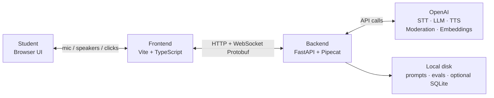
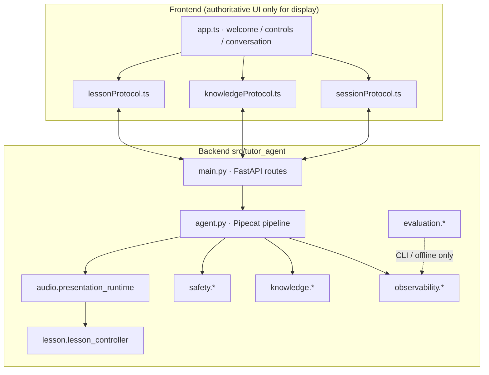
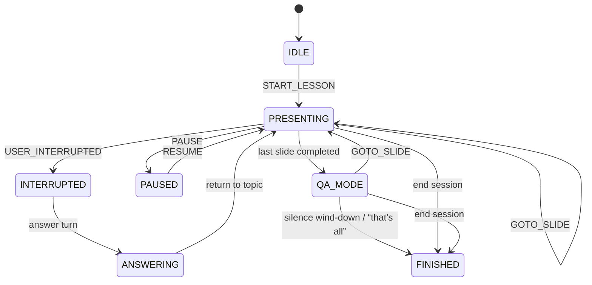
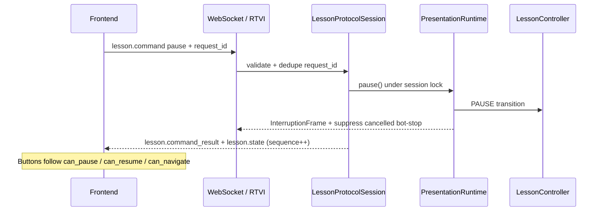
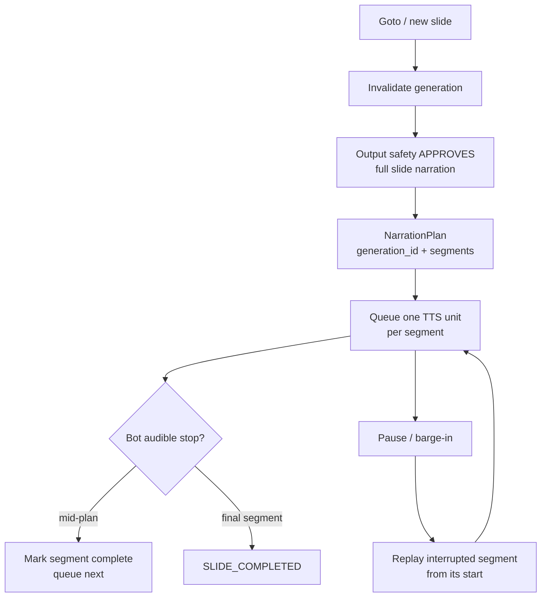
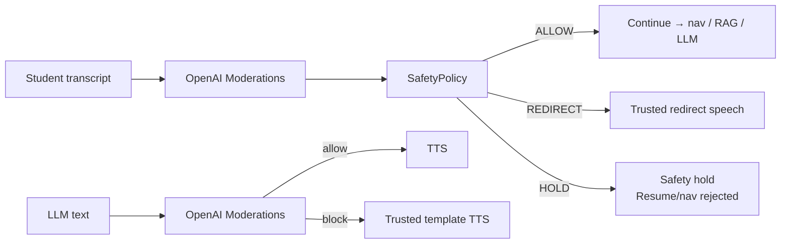
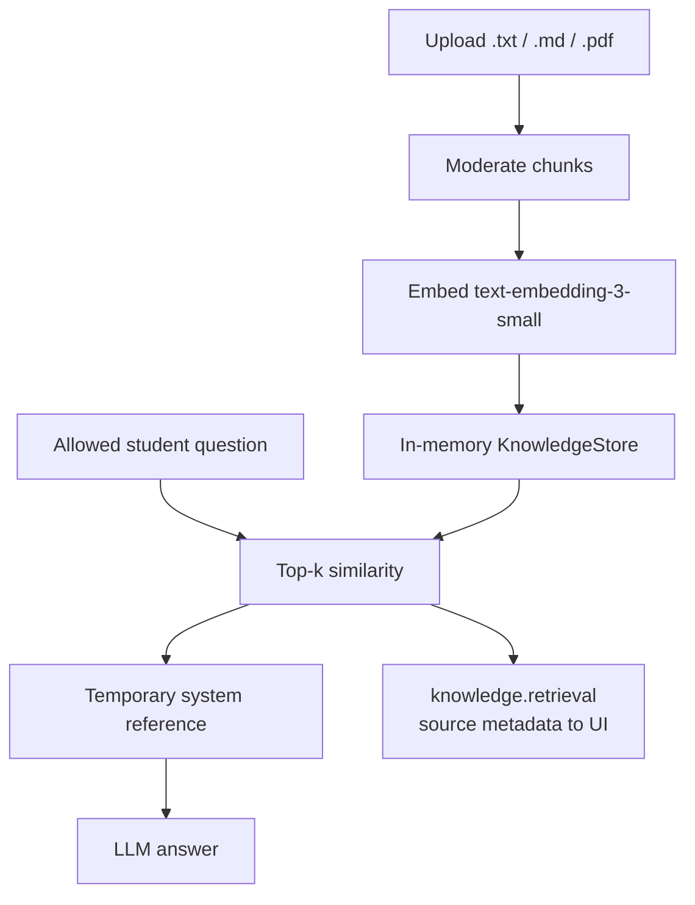
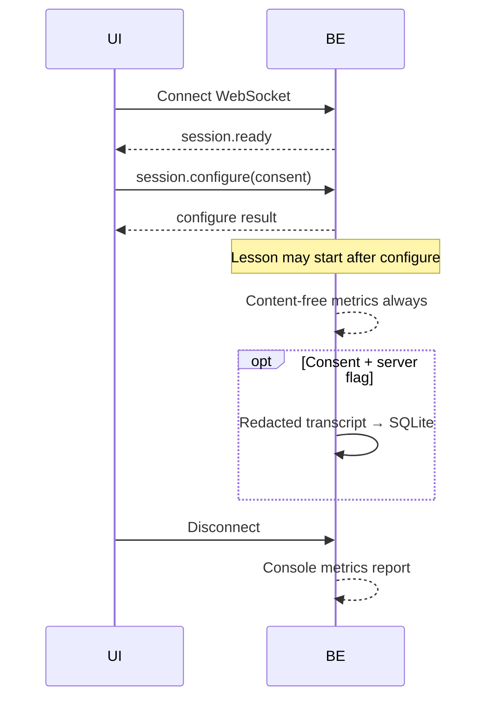
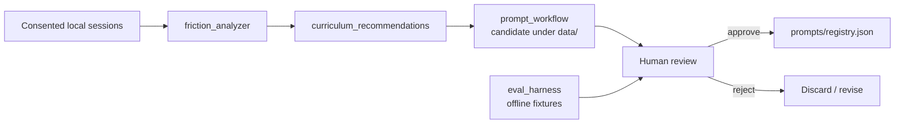

# AI Science Tutor

A **Pipecat + OpenAI** voice tutor that teaches a classroom natural-disasters lesson.
Students listen to guided narration, interrupt with questions, pause and resume, navigate slides,
upload classroom notes for grounded answers, and optionally consent to local redacted transcript storage
for human-reviewed lesson improvement.

This repository is the working product (not a starter stub). Lesson **state is owned by application code**, not by the LLM.

---

## Constraints (assignment)

| Rule | Implementation |
|------|----------------|
| **Pipecat only** for the voice pipeline | `tutor_agent.agent` builds a Pipecat `Pipeline` |
| **OpenAI only** for external AI | STT, LLM, TTS, Moderations, Embeddings |
| No secrets in frontend | `OPENAI_API_KEY` stays in root `.env`; never in `VITE_*` |
| Deterministic lesson control | `LessonController` + `PresentationRuntime` |
| Safe for underage users | Input/output moderation + safety holds in app logic |

---

## What it does

- **8-slide curriculum** on natural disasters with voice narration
- **Interrupt → answer → return to topic** (deterministic modes)
- **Final slide → open Q&A**, then polite wind-down / finish
- **Pause / Resume** at **segment-level** narration boundaries (not exact audio-byte offset)
- **Classroom controls** (voice + UI): next / previous / goto, “I got it”, continue, repeat line, Q&A “that’s all”
- **Safety guardrails** (OpenAI Moderations) on student input and tutor output
- **Classroom Knowledge** upload (TXT / Markdown / text PDF) with in-memory RAG
- **Session metrics** on disconnect; optional consented redacted transcripts (local SQLite)
- **Learning flywheel** (offline friction analysis + reviewable prompt candidates; **never auto-deploys**)
- **Offline eval harness** (fixtures + gated live judge path)

---

## Quick start

```bash
# Backend (Python 3.11.14 exact)
uv python install 3.11.14
uv sync --python 3.11.14
cp .env.example .env   # set OPENAI_API_KEY
uv run python main.py  # or: uv run python -m tutor_agent.main

# Frontend (Node 22, Yarn Classic 1.22.22)
cd frontend
yarn install --frozen-lockfile
yarn dev               # http://localhost:5173
```

Backend listens on **`:7860`**. Full environment notes: [`docs/SETUP.md`](docs/SETUP.md).

| Endpoint | Purpose |
|----------|---------|
| `GET /health/live` | Process up (no OpenAI) |
| `GET /health/ready` | Local config/modules ready (no OpenAI) |
| `POST /connect` | Returns `{ "ws_url": "ws://…/ws" }` |
| `WS /ws` | Pipecat Protobuf voice session |
| `POST /knowledge/documents` | Upload classroom notes |
| `GET /knowledge/status` | In-memory store counts |

---

## High-level design (HLD)

### System context



### Logical architecture



### Design principles

1. **Application owns truth** — slide index, pause, Q&A mode, narration generation/segment are deterministic.
2. **LLM owns wording** — spoken language only, after moderation.
3. **Protocol is explicit** — pause/resume/goto are validated control messages, not guessed from transcript.
4. **Safety is enforced in code** — not prompt-only.
5. **Flywheel is human-gated** — candidates never auto-activate.

---

## Low-level design (LLD)

### Repository layout

```text
tutor-agent/
├── main.py                 # Compatibility launcher → tutor_agent.main
├── src/tutor_agent/
│   ├── main.py             # FastAPI app, health, /connect, /ws
│   ├── agent.py            # Pipecat pipeline + session lifecycle
│   ├── paths.py            # Repo-root prompts/evals/data helpers
│   ├── lesson/             # Curriculum, controller, protocol, classroom UX
│   ├── narration/          # Segment plans, prefetch, chunking
│   ├── audio/              # Presentation runtime, TTS delivery/recovery
│   ├── safety/             # Moderation, policy, processors, redaction
│   ├── knowledge/          # Upload, ingest, store, retrieval
│   ├── observability/      # Metrics, SQLite, export
│   └── evaluation/         # Eval harness, flywheel, prompt registry
├── frontend/               # Classroom UI
├── prompts/                # Approved prompt registry (source of truth)
├── evals/                  # Offline evaluation fixtures
├── tests/                  # Deterministic pytest suite
├── scripts/                # Preflight, scan, config summary
└── docs/                   # Deep-dive docs (see index below)
```

Details: [`docs/PROJECT_STRUCTURE.md`](docs/PROJECT_STRUCTURE.md).

### Voice pipeline (frame path)

```mermaid
flowchart LR
  IN["WebSocket<br/>input"] --> STT["OpenAI<br/>Realtime STT"]
  STT --> IS["InputSafety<br/>Processor"]
  IS --> VN["VoiceNavigation<br/>Processor"]
  VN --> RAG["Retrieval<br/>Processor"]
  RAG --> UCTX["User context<br/>aggregator"]
  UCTX --> LLM["OpenAI LLM"]
  LLM --> OS["OutputSafety<br/>Processor"]
  OS --> TTS["OpenAI TTS"]
  TTS --> OUT["WebSocket<br/>output"]
  OUT --> ACTX["Assistant context<br/>aggregator"]
```



| Stage | Role |
|-------|------|
| **InputSafety** | Moderate final transcripts → allow / redirect / hold |
| **VoiceNavigation** | Deterministic classroom phrases (no LLM) |
| **Retrieval** | Temporary RAG context after ALLOW |
| **OutputSafety** | Buffer LLM reply → moderate → TTS or trusted template |
| **PresentationRuntime** | Orchestrates slides, segments, pause/resume, conversation ledger |
| **LessonLifecycleObserver** | Bridges Pipecat frames ↔ runtime / protocol / metrics |

### Lesson state machine



Modes are defined in `LessonController`. The LLM never chooses the mode.

### Control-plane sequence (UI Pause)



### Narration & resume (segment-level)



**Supported:** deterministic segment replay.  
**Not available:** exact browser playback-offset / word / audio-byte resume (Pipecat + client transport limitation). See [`docs/RESUME_ACCURACY.md`](docs/RESUME_ACCURACY.md).

### Safety path



UI receives only `safety_status` + `safety_notice` (no raw scores/categories). Details: [`docs/SAFETY.md`](docs/SAFETY.md).

### Classroom Knowledge (RAG)



Store is **process memory only** (cleared on backend restart). Not a permanent vector DB. Details: [`docs/KNOWLEDGE_RAG.md`](docs/KNOWLEDGE_RAG.md).

### Session consent & metrics



Export is **CLI-only** (not an HTTP API):

```bash
uv run python -m tutor_agent.observability.session_export summary
uv run tutor-session-export export --output exported_sessions.jsonl
```

See [`docs/SESSION_DATA.md`](docs/SESSION_DATA.md).

### Learning flywheel (human-gated)



**Never auto-deploys.** Live OpenAI judge/optimizer paths are explicitly gated. See [`docs/LEARNING_FLYWHEEL.md`](docs/LEARNING_FLYWHEEL.md) and [`docs/EVALUATIONS.md`](docs/EVALUATIONS.md).

### Frontend display phases (UI only)

Backend slide numbering is unchanged. The UI applies **display rules**:

| Phase | Progress label | Stage |
|-------|----------------|-------|
| Disconnected | `Lesson not started` | Welcome copy + “What to expect” |
| Connecting / IDLE | `Slide 0 of 8` | Preparing… (backend slide not shown) |
| PRESENTING+ | `Slide N of 8` | Real title + progress |
| Disconnect | Welcome again | Display reset only |

---

## Protocol summary

| Envelope | Direction | Purpose |
|----------|-----------|---------|
| `lesson.command` | Client → Server | `pause` \| `resume` \| `goto_slide` \| `get_state` |
| `lesson.command_result` | Server → Client | Ack / error for `request_id` |
| `lesson.state` | Server → Client | Mode, slide, flags, safety, narration progress |
| `session.ready` / `session.configure` | Handshake | Consent + persistence availability |
| `conversation.*` | Server → Client | Live Conversation ledger events |
| `knowledge.retrieval` | Server → Client | Source metadata for last answer |

- Protocol slide indexes are **zero-based**; UI shows **one-based**.
- Frontend ignores stale `sequence` values.
- Duplicate `request_id` returns cached result (no double mutation).

---

## Configuration

Copy [`.env.example`](.env.example) → `.env`. Important non-secret knobs:

| Area | Examples |
|------|----------|
| Models | `OPENAI_MODERATION_MODEL`, `OPENAI_EMBEDDING_MODEL` |
| Narration | `NARRATION_SEGMENT_MAX_CHARACTERS`, `TUTOR_PROMPT_VERSION` |
| TTS recovery | `TTS_NO_AUDIO_MAX_RETRIES`, watchdog timeouts |
| Classroom pacing | `QA_SILENCE_TIMEOUT_SECONDS`, `TTS_SPEECH_SPEED` |
| Session | `TRANSCRIPT_PERSISTENCE_ENABLED`, `SESSION_DB_PATH` |
| Frontend | `VITE_BOT_API_URL=http://localhost:7860` |

```bash
uv run python scripts/print_config_summary.py   # never prints secrets
```

---

## Testing & validation

```bash
# Backend (deterministic)
uv run pytest -q

# Evaluations (offline)
uv run python -m tutor_agent.evaluation.eval_harness validate
uv run python -m tutor_agent.evaluation.eval_harness run-offline-fixtures

# Frontend
cd frontend && yarn vitest run && yarn tsc --noEmit && yarn vite build

# Live-test preflight (no OpenAI request)
uv run python scripts/live_test_preflight.py
```

Live OpenAI classroom validation remains **human-authorized** — see [`docs/LIVE_TEST_PLAN.md`](docs/LIVE_TEST_PLAN.md).

---

## Operational CLIs

| Command | Purpose |
|---------|---------|
| `uv run tutor-agent` | Start backend |
| `uv run tutor-session-export` | Session DB summary / export |
| `uv run tutor-eval` | Evaluation harness |
| `uv run tutor-flywheel` | Local friction analysis |
| `uv run tutor-prompt-workflow` | Prompt candidate generation / invariant check |
| `uv run python scripts/scan_submission.py <dir>` | Scan for secrets / private artifacts |

---

## Documentation index

| Doc | Contents |
|-----|----------|
| [`docs/SETUP.md`](docs/SETUP.md) | Exact toolchain install |
| [`docs/ARCHITECTURE.md`](docs/ARCHITECTURE.md) | Control-plane ownership & flows |
| [`docs/PROJECT_STRUCTURE.md`](docs/PROJECT_STRUCTURE.md) | Package map & entry points |
| [`docs/SAFETY.md`](docs/SAFETY.md) | Threat model & moderation |
| [`docs/KNOWLEDGE_RAG.md`](docs/KNOWLEDGE_RAG.md) | Upload & retrieval |
| [`docs/SESSION_DATA.md`](docs/SESSION_DATA.md) | Metrics, consent, export |
| [`docs/RESUME_ACCURACY.md`](docs/RESUME_ACCURACY.md) | Segment resume contract |
| [`docs/LEARNING_FLYWHEEL.md`](docs/LEARNING_FLYWHEEL.md) | Offline improvement loop |
| [`docs/EVALUATIONS.md`](docs/EVALUATIONS.md) | Judge harness & promotion gates |
| [`docs/REQUIREMENTS_TRACEABILITY.md`](docs/REQUIREMENTS_TRACEABILITY.md) | Goals ↔ implementation |
| [`docs/IMPLEMENTATION_LOG.md`](docs/IMPLEMENTATION_LOG.md) | Append-only iteration history |
| [`AGENTS.md`](AGENTS.md) | Rules for humans & coding agents |

---

## Known limitations

- Resume is **segment-level**, not exact audio/word offset.
- RAG is **in-memory** (lost on restart; not multi-worker / multi-tenant).
- Local SQLite is demo-grade (no auth productization).
- Output TTS waits for full moderated LLM response (latency tradeoff).
- Prompt / eval promotion always requires **human approval**.

---

## License note

Upstream Pipecat example portions retain their original license headers (BSD 2-Clause where noted). Project-specific tutor logic lives under `src/tutor_agent/` and `frontend/`.
